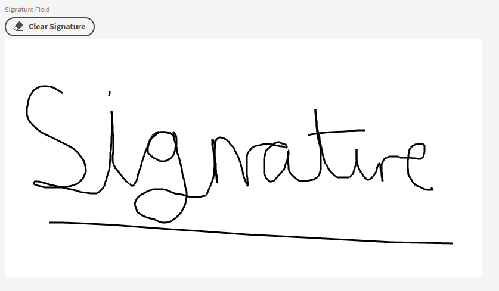

# Budibase-Signature-Plugin

## Description
A plugin that allows signatures to be created and saved in budibase, this plugin uses text fields to save the data and image fields to see the image

## Component Fields

* Name - The name of the component
* Field - The selected text field to store the signature image data
* Label - Default budibase label for forms
* Width - The width of the component, valid inputs are css width attributes
* Height - The height of the component, valid inputs are css height attributes
* Pen Colour - The colour of the writing on the canvasm, valid inputs are html colours e.g. Black, #000000, rgb(0, 0, 0)
* Background Colour - The colour of the background, valid inputs are html colours e.g. White, #FFFFFF, rgb(255, 255, 255)
* Border Outline - The style of the border, set to none for no border
* Border Colour - The colour of the border e.g. Black, #000000, rgb(0, 0, 0)
* Border Thickness - The thickness of the border e.g. Thin, 1px
* Show Clear Signature Button - Do you want to show a button at the top of the signature canvas to allow the end user to clear their signature
* Clear Signature Button Text - The text to display on the clear signature button e.g. ❌, Clear Signature
* Clear Signature Button Confirm Text - The text to display on the dialog prompt when then clear signature button is pressed e.g. This will clear the current signature, do you want to contiune?
* Show Clear Signature Button Icon - Show the eraser icon on the clear signature button

## How to display a saved siganture

To display a saved siganture use an image component and set the URL to the text field you used earlier.

## Test app

[Test app](./assets/SignatureApp.tar.gz)

Find out more about [Budibase](https://github.com/Budibase/budibase).